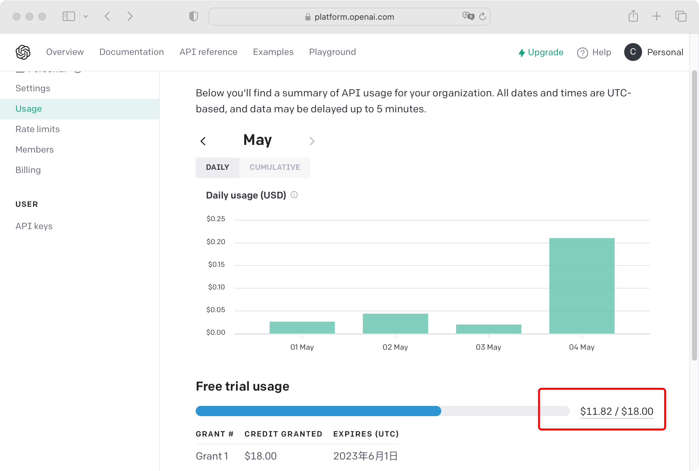

此插件封装了openai chatgpt接口，使其可以在HBuilderX内使用。

## 插件功能

* 左侧视图：chatGPT对话视图 [详情](chat-main)
* 右侧编辑器：Coding ChatGPT [详情](chat-coding)

## ChatGPT是否免费？

首先，说明一点，ChatGPT并不是免费的，尤其是调用openai api。

注册 openai chatGPT账号后，它们提供了一定的免费额度。如下是小编的账户截图！

**免费额度耗尽后，就需要充值使用，而且是不支持中国境内银行卡/信用卡。**

**请不要再问为什么不能无限使用。**

## ChatGPT官网账号注册是否收费？

如果您的网络可以正常访问 [https://openai.com/](https://openai.com/)，且您有一个国外手机号，直接注册即可。

如果您不存在网络问题，但是没有国外手机号，请自行搜索第三方接码平台，大部分接码平台充值**最低1美元**。

对于绝大部分人来说，网络 + 国外手机号，都是无法解决的问题。

## **所以使用本插件，请给好评+收藏，感激不尽。**